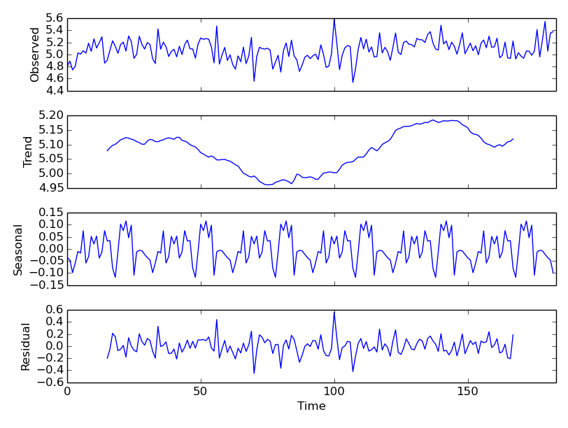

# 阿里音乐流行趋势预测大赛，第一季第二个数据集（100个歌手）
## data文件夹
放置`p2_mars_tianchi_songs.csv`、`p2_mars_tianchi_user_actions.csv`两个文件

## 程序
* pp2.py是数据的预处理和统计部分
 * 将两个数据文件放在data文件夹下，然后在ipython里面直接运行这个脚本就可能得到数据预处理的结果
 * 主要统计了歌曲、用户、歌手的一些数据，相对于s1d1里面的`pp.py`，统计的数据做了简化，只计算出了每个歌手每天的播放次数，因为后面使用的模型只使用了歌手的播放量这个数据
 * 运行后的输出：

```
date num  244
songs num  26958
songs_id_to_songinfo num  26958
artist num  100
language type num  9
artist gender num  3
user num 536024
song num that has action 24943
action type num 3
```

* le2.py是机器学习的部分
 * 给每个歌手的播放量训练一个模型
 * 函数`APtoDF()`将每个歌手每天的播放量存到`pandas.DataFrame`里面
 * 因为播放量数据经常出现暴增和递减的波动，对播放量取log得到的数据进行学习
 * 函数`stl()`使用`tsa.seasonal_decompos`分解出了数据的周期波动，包括周波动、月波动，用`statsmodels`的`tsa.arima_model`对去掉了周波动和月波动之后得到的趋势做拟合，并画图，在拟合之前，先用`nonparametric.lowess`对趋势数据进行了平滑处理
 * 用`nonparametric.lowess`对趋势数据进行了平滑处理时，存在一个参数`frac`，`frac`越大，数据越平滑，经过调参，发现frac=0.2是个比较好的结果，去掉了短期的波动，能够反映出数据的趋势
 * 但是frac比较大时，`tsa.arima_model`有时会得不到结果，所以就设置了递减的多个frac让`tsa.arima_model`去尝试
 * 运行`stl(98)`表示对第98个歌手进行学习（从0开始编号），得到每周的周期性波动，每月的周期性波动，去掉周周期、月周期波动后的趋势的（蓝色线），以及平滑和预测（红色线）原始的播放量（蓝色线）和播放量的预测（绿色线），
